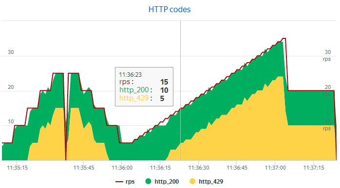

### Task 6
It can be tested with a load testing tool such as jMeter, Yandex.Tank, Taurus etc.

Here is the simple example of such a test.  
It using Nginx server, configured to limit with 600 requests per minute, and load-creating tool Yandex.Tank.

Web results of the test are here:  
https://overload.yandex.net/167927

The graph of HTTP codes shows that when a number of requests exceeds 10 per second, the server responses with 429 http code:    

To perform it:
- Pull docker image of the server:  
`docker pull kavzov/nginx-limit-req-sandbox`

- Pull docker image of Yandex.Tank:  
`docker pull direvius/yandex-tank`

- Start the server:  
`docker run -d --rm -p 8080:8080 kavzov/nginx-limit-req-sandbox`

- Put the [load.yaml](https://github.com/kavzov/testtask/raw/master/task_6/load.yaml) file to your working directory and start the load test:  
`docker run -v $(pwd):/var/loadtest --net host --rm -it direvius/yandex-tank`

_(It is necessary to have account at [overload.yandex.net](http://overload.yandex.net) to get web statistics of the test)_
